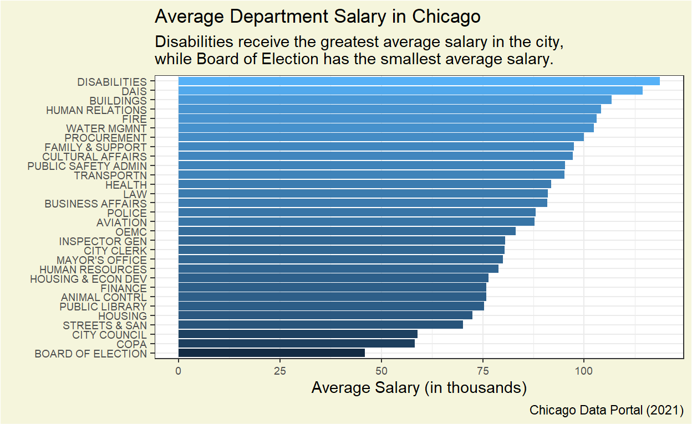

<div class="layout-chunk" data-layout="l-body">
<div class="sourceCode"><pre class="sourceCode r"><code class="sourceCode r"><span class='va'>raw_url</span> <span class='op'>&lt;-</span> <span class='st'>"https://data.cityofchicago.org/resource/xzkq-xp2w.json"</span>
<span class='va'>salaries</span> <span class='op'>&lt;-</span> <span class='fu'><a href='https://rdrr.io/pkg/jsonlite/man/fromJSON.html'>fromJSON</a></span><span class='op'>(</span><span class='va'>raw_url</span><span class='op'>)</span>
<span class='va'>salaries</span><span class='op'>%&gt;%</span>
  <span class='fu'><a href='https://rdrr.io/r/stats/filter.html'>filter</a></span><span class='op'>(</span><span class='va'>full_or_part_time</span> <span class='op'>==</span> <span class='st'>"F"</span>, <span class='va'>salary_or_hourly</span> <span class='op'>==</span> <span class='st'>"Salary"</span><span class='op'>)</span><span class='op'>%&gt;%</span>
  <span class='fu'>select</span><span class='op'>(</span><span class='va'>department</span>, <span class='va'>annual_salary</span><span class='op'>)</span><span class='op'>%&gt;%</span>
  <span class='fu'>group_by</span><span class='op'>(</span><span class='va'>department</span><span class='op'>)</span><span class='op'>%&gt;%</span>
  <span class='fu'>drop_na</span><span class='op'>(</span><span class='va'>annual_salary</span><span class='op'>)</span><span class='op'>%&gt;%</span>
  <span class='fu'>summarize</span><span class='op'>(</span>salary <span class='op'>=</span> <span class='fu'>parse_double</span><span class='op'>(</span><span class='va'>annual_salary</span><span class='op'>)</span><span class='op'>)</span><span class='op'>%&gt;%</span>
  <span class='fu'>mutate</span><span class='op'>(</span>total<span class='op'>=</span><span class='fu'>n</span><span class='op'>(</span><span class='op'>)</span><span class='op'>)</span><span class='op'>%&gt;%</span>
  <span class='fu'>summarize</span><span class='op'>(</span>avg_salary<span class='op'>=</span><span class='fu'><a href='https://rdrr.io/r/base/sum.html'>sum</a></span><span class='op'>(</span><span class='va'>salary</span><span class='op'>)</span><span class='op'>/</span><span class='op'>(</span><span class='fl'>1000</span><span class='op'>*</span><span class='va'>total</span><span class='op'>)</span><span class='op'>)</span><span class='op'>%&gt;%</span>
  <span class='fu'>slice</span><span class='op'>(</span><span class='fl'>1</span><span class='op'>)</span><span class='op'>%&gt;%</span>
  <span class='fu'>arrange</span><span class='op'>(</span><span class='va'>avg_salary</span><span class='op'>)</span><span class='op'>%&gt;%</span>
  <span class='fu'>ungroup</span><span class='op'>(</span><span class='va'>department</span><span class='op'>)</span><span class='op'>%&gt;%</span>
  <span class='fu'>mutate</span><span class='op'>(</span>newDepart <span class='op'>=</span> <span class='fu'>parse_factor</span><span class='op'>(</span><span class='va'>department</span><span class='op'>)</span><span class='op'>)</span><span class='op'>%&gt;%</span>
<span class='fu'>ggplot</span><span class='op'>(</span>mapping<span class='op'>=</span><span class='fu'>aes</span><span class='op'>(</span>x<span class='op'>=</span><span class='va'>newDepart</span>,y<span class='op'>=</span><span class='va'>avg_salary</span>, fill<span class='op'>=</span><span class='va'>avg_salary</span><span class='op'>)</span><span class='op'>)</span><span class='op'>+</span><span class='fu'>geom_col</span><span class='op'>(</span>show.legend <span class='op'>=</span> <span class='cn'>FALSE</span><span class='op'>)</span><span class='op'>+</span><span class='fu'>coord_flip</span><span class='op'>(</span><span class='op'>)</span><span class='op'>+</span>
<span class='fu'>labs</span><span class='op'>(</span>title<span class='op'>=</span><span class='st'>"Average Department Salary in Chicago"</span>, subtitle<span class='op'>=</span><span class='st'>"Disabilities receive the greatest average salary in the city,\nwhile Board of Election has the smallest average salary."</span>, x<span class='op'>=</span><span class='st'>""</span>, y<span class='op'>=</span><span class='st'>"Average Salary (in thousands)"</span>, caption<span class='op'>=</span><span class='st'>"Chicago Data Portal (2021)"</span><span class='op'>)</span><span class='op'>+</span><span class='fu'>theme_bw</span><span class='op'>(</span><span class='op'>)</span><span class='op'>+</span><span class='fu'>theme</span><span class='op'>(</span>axis.text <span class='op'>=</span> <span class='fu'>element_text</span><span class='op'>(</span>size <span class='op'>=</span> <span class='fl'>7</span><span class='op'>)</span>,plot.background <span class='op'>=</span> <span class='fu'>element_rect</span><span class='op'>(</span>fill <span class='op'>=</span> <span class='st'>"beige"</span><span class='op'>)</span><span class='op'>)</span>
</code></pre></div>


</div>


```{.r .distill-force-highlighting-css}
```
